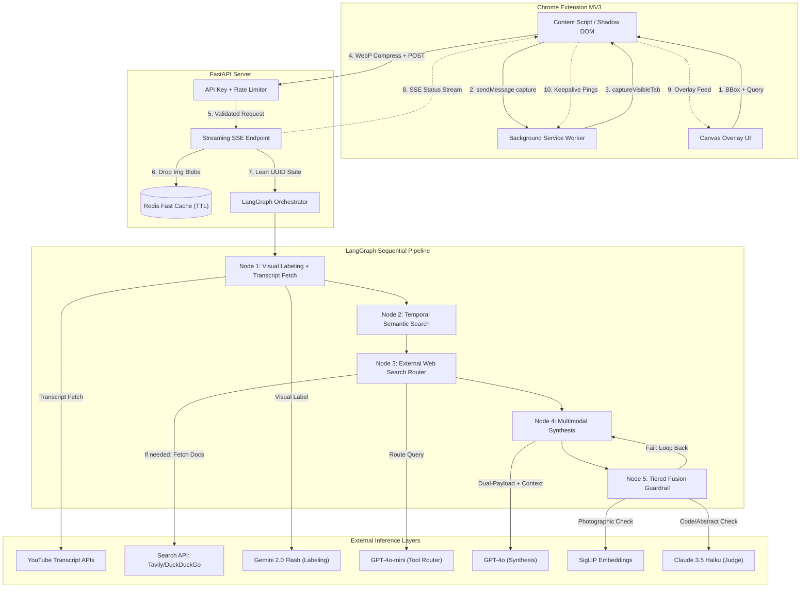
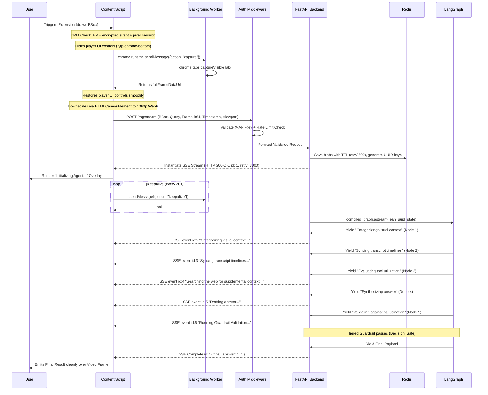
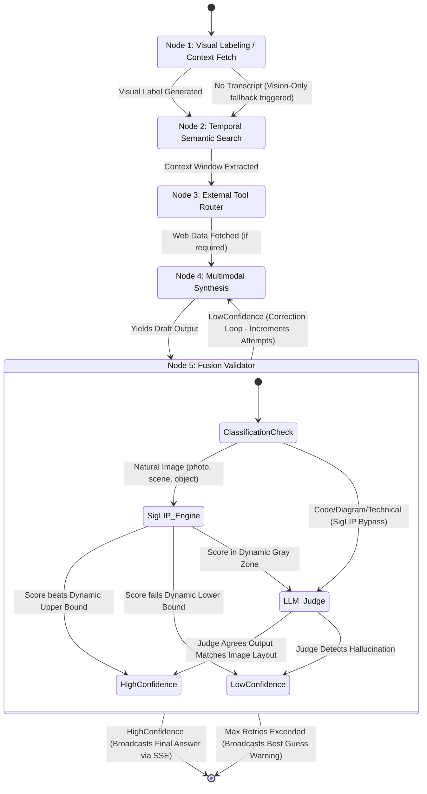

# ContextLens — Master System Implementation Documentation

**ContextLens** is a self-correcting Multimodal Video RAG Chrome Extension that lets users highlight any object inside a YouTube video and receive an instant, hallucination-guarded, context-aware explanation — powered by a LangGraph agentic pipeline fusing vision models, semantic transcripts, and real-time web search.

This document is the exhaustive architectural blueprint for ContextLens. It consolidates every engineering hurdle, technical decision, and edge-case mitigation strategy synthesized across the entire system design lifecycle.

> [!NOTE]
> *Diagramming Note:* Standard `mermaid` markdown was used to ensure native rendering and compatibility within the artifact viewer.

---

## 1. System Design Principles & The "Why"

This system targets and resolves 12 critical engineering flaws natively associated with building agentic, browser-based Multimodal AI:

1. **The Tainted Canvas (CORS error):** Fixing standard `.drawImage()` DOM tainting policies by utilizing the Background Service Worker's `chrome.tabs.captureVisibleTab()`.
2. **The Hostile YouTube DOM:** Mitigating continuous `video.html5-main-video` class mutations and UI reactivity by using generic `ResizeObserver` API coupled with an isolated Shadow DOM overlay.
3. **The Crop Context Issue:** Solving the "zoomed-in" context bleed by passing a "Dual-Payload" (the full 16:9 frame + the zoomed bounding box) to the LLM to preserve macro spatial awareness.
4. **Network Saturation:** Crushing 10MB+ pristine 4K screenshots down to ~300KB using an `HTMLCanvasElement` conversion pipeline (`image/webp` at 0.7 quality) in the Content Script BEFORE firing the POST request.
5. **The Latency UX Problem:** Solving the 10-15s black-box spinning wheel abandonment rate using FastAPI's `.astream()` native Server-Sent Events (SSE).
6. **LangGraph State Bloat:** Moving multi-megabyte base64 strings out of LangGraph's time-travel checkpointing memory database by passing lightweight Redis UUID pointers instead.
7. **The "Indexical Query" Paradox:** Forbidding semantic transcript searches based purely on the user's prompt (e.g. "What is this?"). First, the vision model acts to explicitly label the visual image, then searches that visual label through the transcript to fix audio/visual sync drift.
8. **Circular UI Hallucination Dependencies:** Preventing a hallucinating LLM from classifying its own image type. Instead, a "Tiered Fusion Guardrail" relies on deterministic Math (SigLIP) first, transitioning into a multi-agent LLM Judge only for abstraction gray-zones.
9. **Redis Session Lifecycle Leaking:** Preventing unbounded memory growth from stale session images by enforcing TTL-based expiry on all Redis keys and configuring a `volatile-ttl` eviction policy as a safety net.
10. **SSE Stream Fragility:** Resolving the unhandled edge-cases in the real-time SSE transport — client disconnect detection (to cancel wasted compute), per-node timeout budgets (to prevent indefinite hangs), and `Last-Event-ID` reconnection support for network interruptions.
11. **Zero-Trust API Perimeter:** Securing the compute-heavy `/rag/stream` endpoint against abuse via `X-API-Key` header validation, per-session sliding-window rate limiting, and CORS origin restriction locked to the Chrome Extension's `chrome-extension://<extension-id>` origin.
12. **MV3 Ephemeral Worker Survival:** Preventing Chrome from terminating the Background Service Worker mid-pipeline. MV3 Service Workers are ephemeral (~30s idle timeout, ~5 min max active). The Content Script sends periodic keepalive pings via `chrome.runtime.sendMessage()` during SSE streaming to hold the worker alive.

---

## 2. Tier 1: Frontend Architecture (MV3 Extension)

### 2.1 UI Injection & DOM Isolation

- The content script relies on a `ResizeObserver` bound to the active video player element to guarantee the overlay maps to responsive resizing modes (Theater, Fullscreen, Default).
- It injects a Shadow DOM overlay to host the bounding box UI. This protects the extension's CSS from bleeding outward into YouTube's DOM and prevents YouTube's obfuscated, reactive scripts from destroying the injected nodes in the background.

### 2.2 Dual-Payload & Capture Flow

When a user highlights an object inside the video bounding box, a strict synchronous cascade executes:

1. **DRM Pre-Flight Fallback:** Before capture, the script performs a two-tier DRM detection:
   - **Tier A (EME API Check):** The script probes `navigator.requestMediaKeySystemAccess('com.widevine.alpha', supportedConfigurations)`. If the video element has active `MediaKeys` attached (checked via the `encrypted` event listener registered at injection time), it indicates Widevine DRM is active.
   - **Tier B (Black-Frame Pixel Heuristic):** As a fallback (since some DRM states are ambiguous), after capture the script samples a grid of pixels from the returned frame. If ≥95% of sampled pixels are `rgb(0,0,0)` or `rgb(0,128,0)` (green-screen DRM artifact), it aborts gracefully with a UI warning instead of sending a useless payload to the backend.
2. **UI Occlusion Mitigation:** The script temporarily forces the YouTube scrubber bar (`.ytp-chrome-bottom`) to `opacity: 0 !important` to ensure the screenshot captures the pure tutorial context behind the controls.
3. **The Viewport Capture:** The Content Script sends a `chrome.runtime.sendMessage({action: "capture"})` to the Background Service Worker. The SW executes `chrome.tabs.captureVisibleTab()` and returns the `fullFrameDataUrl` via the message response callback.
4. **Canvas Compression:** The returned `fullFrameDataUrl` is pushed into an invisible `HTMLCanvasElement` in the Content Script, scaled to a `1080p` max-dimension rule, and encoded to `image/webp` at 0.7 quality via `.toDataURL('image/webp', 0.7)`. *(Note: `OffscreenCanvas` with `.convertToBlob()` is an alternative if compression is moved into the Service Worker context.)*
5. **The Dual-Payload:** The Extension sends the user's screen-relative Bounding Box coordinates (`[x,y,w,h]`), the current `viewport_dimensions`, AND the compressed Full Frame. The Content Script immediately opens an SSE listener hook to receive agentic thoughts.

### 2.3 MV3 Service Worker Lifecycle Management

Chrome's Manifest V3 enforces an **ephemeral Service Worker** — it can be terminated after ~30 seconds of inactivity or ~5 minutes of continuous execution. To prevent the SW from dying mid-pipeline:

- **During SSE Streaming:** The Content Script sends a lightweight keepalive `chrome.runtime.sendMessage({action: "keepalive"})` every 20 seconds while the SSE stream is open. The SW responds with an acknowledgment, resetting Chrome's idle timer.
- **Alarm Fallback:** A `chrome.alarms.create("keepalive", {periodInMinutes: 0.4})` is set as a secondary heartbeat in case the Content Script's message loop is interrupted.
- **Graceful Degradation:** If the SW is terminated despite keepalives, the Content Script detects the `chrome.runtime.lastError` on the next message attempt and shows a "Session interrupted — please retry" overlay.

---

## 3. Tier 2: The API Backend (FastAPI + Redis)

### 3.1 Redis "Lean State" Pattern

To avoid breaking LangGraph's internal PostgreSQL/SQLite check-pointing (which takes a snapshot of the graph state at every transition node for rewind abilities):

- The massive image blob string is intercepted instantly by the FastAPI POST route.
- The base64 full frame is stored in Redis with a 1-hour TTL: `redis.set(f"{session_id}_full", full_frame_b64, ex=3600)`.
- The backend crops the coordinate bounds from the full frame to create the "snippet". The snippet is stored in Redis with the same TTL: `redis.set(f"{session_id}_snippet", snippet_b64, ex=3600)`.
- LangGraph is instantiated with a tiny JSON dict comprising the `session_id` and text pointers.
- **Eviction Policy:** Redis is configured with `maxmemory-policy volatile-ttl` to prioritize evicting keys closest to expiry when memory pressure is reached, rather than allowing OOM crashes.

### 3.2 Real-Time SSE Transport

The endpoint `/rag/stream` acts as a streaming proxy.

- It yields an async generator wrapping `compiled_graph.astream_events()`.
- Any intermediate computational thoughts yielded from inside the graph nodes are forwarded sequentially to the Extension's open HTTP connection using the `text/event-stream` format.
- **Client Disconnect Detection:** Inside the async generator loop, the server polls `await request.is_disconnected()` before each yield. If the client has disconnected (user navigated away), the generator cancels the LangGraph execution task and exits cleanly to avoid wasting compute.
- **Per-Node Timeout Budgets:** Each LangGraph node is wrapped in an `asyncio.wait_for()` with explicit timeout ceilings:
  - Node 1 (Visual Labeling): 5 seconds
  - Node 2 (Transcript Search): 8 seconds
  - Node 3 (Web Search): 10 seconds
  - Node 4 (Synthesis): 12 seconds
  - Node 5 (Guardrail): 8 seconds
  - If a node times out, the graph routes to its fallback path (e.g., skip transcript, skip web search) rather than hanging indefinitely.
- **SSE Reconnection Support:** Each SSE event includes an `id:` field (monotonically increasing). The `retry: 3000` field instructs the client to reconnect after 3 seconds on disconnect. On reconnection, the client sends the `Last-Event-ID` header, and the backend replays events from that point forward using a short-lived Redis event log (`ex=300`).

### 3.3 API Security & Rate Limiting

The `/rag/stream` endpoint is compute-intensive (multiple LLM calls + SigLIP inference per request). It is protected by:

- **API Key Validation:** A FastAPI middleware checks for a valid `X-API-Key` header on every request. The key is embedded in the Chrome Extension's config and rotated periodically. Invalid or missing keys receive `HTTP 401`.
- **Per-Session Rate Limiting:** A sliding-window rate limiter (backed by Redis sorted sets) allows a maximum of 10 requests per minute per session. Excess requests receive `HTTP 429 Too Many Requests` with a `Retry-After` header.
- **CORS Origin Lock:** The FastAPI CORS middleware is configured with `allow_origins=["chrome-extension://<extension-id>"]` — no wildcard origins. This prevents browser-based abuse from arbitrary web pages.

---

## 4. Tier 3: LangGraph Orchestration & Edge Routing

The LangGraph backend acts as an autonomous agent moving through a cyclical state machine. It is designed to self-heal and self-correct hallucinatory outputs before they ever hit the client stream.

### Node 1: Visual Abstraction & Fast-Fail

Often, a user will ask "Why?" or "What does this mean?" without any searchable semantic keywords.

- *Process:* The agent pulls the `snippet_ref` from Redis and asks a fast, lightweight Vision Model (**Gemini 2.0 Flash** — cheapest multimodal option with strong vision accuracy) to structurally label the cropped image (e.g., "A Python dictionary defining system variables inside a code editor").
- *Anti-Scraping Resilience:* YouTube aggressively throttles transcript APIs. A multi-tier fallback strategy is employed:
  - **Primary:** The `youtube-transcript-api` library is invoked inside a `tenacity` retry loop with exponential backoff (initial=1s, max=5s, max_attempts=3, total ceiling=15s). Requests are distributed through a **managed residential rotating proxy pool** (e.g., BrightData or SmartProxy) to bypass IP-based HTTP 429 throttling.
  - **Fallback 1:** If the primary exhausts retries, the node falls back to the **YouTube Data API v3** using authenticated OAuth2 credentials. This API uses quota-based rate limiting (not IP-based), making it resilient to proxy bans. The `captions.download` endpoint retrieves auto-generated or manual subtitles.
  - **Fallback 2:** As a last resort, `yt-dlp --write-auto-sub --skip-download` is invoked as a subprocess to extract subtitle files directly.
- *Fast-Fail Strategy:* If all three tiers fail (meaning no subtitles exist on the video or all sources are blocked), the State gracefully routes around transcript augmentation. It falls back natively into a Vision-Only flow, warning the user via the SSE stream that contextual hints might be missing.

### Node 2: Temporal Context & Semantic Transcript Search

- Using the generated "Visual Label" from Node 1, combined with the user's raw prompt, the system applies **Temporal Context** by restricting search to a sliding window around the user's `timestamp`. It then queries the vectorized transcript within that timeline.
- *Why:* This fixes the "Auto-Generated Transcript Drift." The timestamp of the physical framework might be 5–10 seconds displaced from the spoken audio. Combining the hard timestamp (temporal context) with semantic search finds the exact dialogue block connected to the visual concept, rather than relying on an arbitrary `+/- 60s` rule.

### Node 3: External Tool Routing (Web Search)

- If the semantic transcript provides insufficient context (e.g., the video mentions "This is the new LangGraph API" but doesn't explain what LangGraph is), the state machine pauses synthesis.
- It routes the user query and visual label to a cost-efficient text-only LLM (**GPT-4o-mini** — fast, cheap, strong tool-use capability) equipped with a Web Search API tool (Tavily or DuckDuckGo) to fetch strict, updated definitions or documentation from the web.
- The retrieved `tool_data` string is appended to the State payload.

### Node 4: Multimodal Synthesis

- The Heavy-Duty LLM (**GPT-4o** — strongest multimodal reasoning) receives:
  1. The User's raw query
  2. The Full Screen Context Image (Redis `full_frame_ref`)
  3. The Tightly Cropped Focus Snippet (Redis `snippet_ref`)
  4. The augmented Semantic Transcript window
  5. The external `tool_data` (if applicable)
  6. The `bbox_coordinates` mapped against `viewport_dimensions` to convert relative coordinates back to the macro spatial context

- *Cost Note:* At current API pricing (as of early 2025), a typical pipeline invocation costs approximately $0.02–$0.05, dominated by the GPT-4o multimodal synthesis call (~$0.01–$0.03 for two images + text context). The lightweight models (Gemini Flash, GPT-4o-mini) contribute <$0.005 combined.

### Node 5: The Tiered Fusion Guardrail

To fix Circular Dependency algorithms and brittle mathematical thresholds, we use a dynamic validation cascade instead of hardcoded floats.

1. **Tier 1 (Math Check — Skippable for Code):** The State computes a **SigLIP cosine similarity score** between the image embedding (extracted by passing the cropped snippet through SigLIP's Vision Transformer encoder) and the text embedding (extracted by passing the Draft Answer through SigLIP's text encoder) in the shared latent space.
   - **Code/Diagram Fast-Path Bypass:** If `visual_classification_label` ∈ `{"code", "terminal", "IDE screenshot", "UML diagram", "CLI output", "architecture diagram"}`, SigLIP Tier 1 is **skipped entirely**. SigLIP was trained primarily on natural images with natural language captions — its embedding quality for code screenshots and technical diagrams is unreliable, producing near-zero scores that would trigger the Judge on every programming tutorial request. For these categories, the pipeline routes directly to the LLM-Judge.
2. **Tier 2 (Dynamic Threshold & Gray Zone Verification):**
    - Instead of hardcoding "0.75 is a pass", we use the `visual_classification_label` (from Node 1) to set dynamic thresholds. A "photograph of a cat" dictates a high mathematical threshold (e.g., > 0.82). An "abstract UML diagram" lowers the math threshold (e.g., > 0.35) and automatically biases toward LLM-Judge verification.
    - If the score falls below the dynamic lower bound: The answer is hallucinated. Fail.
    - If the score falls into the dynamic gray zone: The State invokes an independent **LLM-Judge** prompt. The Judge uses **Claude 3.5 Haiku** — a different model family from the synthesizer (GPT-4o) to guarantee independent reasoning and prevent circular validation bias. The Judge receives both images and cross-verifies the logical constraints of the Draft Answer against the visual layout of the crop.

### Node 6: The Cyclical Edge Router

If the Fusion Guardrail fails, the Graph loops backwards to Node 4.
The error context is actively passed back into the state machine: "Your previous guess was hallucinated. Your attention focused on the wrong object. Re-evaluate the snippet context."
If `correction_attempts >= 3`, the Graph terminates its recursive loop and pushes a "Best Guess" warning prefix to the final SSE payload to prevent infinite compute overhead.

---

## 5. Architectural Diagrams

### 5.1 Macro Ecosystem Architecture



### 5.2 Real-Time User Flow Sequence

> [!NOTE]
> Target latency: **sub-15 seconds** for non-web-search paths. Exact latency depends on LLM provider response times and network conditions. Web-search paths may add 5–10s.



### 5.3 LangGraph State Topology & Self-Correction



### 5.4 The "Lean State" Code Contract

The dictionary traveling between the nodes defined above:

```python
from typing import TypedDict

class LeanAgentState(TypedDict):
    # Base
    session_id: str
    video_id: str
    timestamp: float
    query: str

    # Viewport & Spatial Awareness
    viewport_dimensions: tuple[int, int]  # (width, height) of browser viewport at capture time
    video_resolution: str                 # e.g., "1080p", "720p", "4K" — for crop-to-frame mapping
    bbox_coordinates: list[float]         # [x, y, w, h] relative to viewport_dimensions

    # Context Derivations
    has_transcript: bool
    transcript_context: str
    visual_classification_label: str
    tool_data: str  # Appended via Web Search Node

    # Lean Redis Storage Navigation Pointers
    full_frame_ref: str
    snippet_ref: str

    # Orchestrator Mutations & Memory
    draft_answer: str
    validation_score: float
    correction_attempts: int
    current_node: str  # Tracks active node for SSE status broadcasting
```

---

## 6. SOTA Research Validation

This architectural blueprint directly integrates findings from cutting-edge research in Multimodal RAG and Multi-Agent Systems to guarantee mathematically proven resilience:

1. **SAM-RAG (Self-adaptive Multimodal RAG):** Reading Chapter 3.4 of the full paper reveals that standard RAG retrieves static context. SAM-RAG introduces a dynamic relevance-verification cycle. We implement this fully in **Nodes 1 and 2**: The prompt to the semantic transcript search relies on generating a dynamic, query-specific caption (`d_sc`) for the user's `snippet_ref`, rather than relying on generic index captions. Furthermore, the Context Node utilizes SAM-RAG's three-flag verification framework (`isRel` for query relevance, `isSup` for document supportability) before appending the transcript data to the payload, ensuring noisy dialogue is dropped.

2. **ViF (Mitigating Hallucination Snowballing via Visual Flow):** Chapter 3 of the full ViF paper identifies that multimodal agents snowball hallucinations because they rely on textual relays instead of native "Visual Flow." The paper natively achieves this by manipulating Softmax attention reallocation matrices (`α` parameter scaling) specifically on unimodal vision tokens in the middle layers of open-source transformers. *Architectural Relationship:* Because our system relies on commercial closed-weights APIs (like GPT-4o) where we cannot alter the attention temperature of middle layers, **our Redis Lean State Pipeline operates at the application-layer to achieve a complementary — not equivalent — goal**: by preserving immutable base64 visual pointers across the entire LangGraph pipeline, we ensure the raw visual data is never lost, degraded, or replaced by textual summaries between nodes. This prevents the *opportunity* for textual hallucination snowballing by forcing every downstream node to re-attend to original visual inputs. However, this does not control the LLM's internal attention allocation the way ViF does at the model-layer. *Future Path:* If open-source multimodal models (e.g., LLaVA, Qwen-VL) are adopted, ViF's attention reallocation strategy can be directly implemented at inference time for stronger guarantees.

3. **Multi-RAG (Adaptive Video Understanding):** Validates our synthesis strategy in **Node 4**. By fusing targeted spatial image crops, macro full-frame context, semantic timeline text, and external tool intelligence simultaneously, we drastically reduce cognitive input constraints and process complex instructional videos with fewer reasoning steps than standard linear Video-LLMs.

---

## 7. Model Assignment & Cost Summary

| Node | Purpose | Model | Rationale | Est. Cost/Call |
|------|---------|-------|-----------|----------------|
| Node 1 | Visual Labeling | **Gemini 2.0 Flash** | Cheapest multimodal with strong vision; fast response (<2s) | ~$0.001 |
| Node 3 | Web Search Routing | **GPT-4o-mini** | Fast text-only tool-use; cost-efficient for routing decisions | ~$0.002 |
| Node 4 | Multimodal Synthesis | **GPT-4o** | Strongest multimodal reasoning; handles dual-image + text context | ~$0.01–0.03 |
| Node 5 (Judge) | Hallucination Verification | **Claude 3.5 Haiku** | Different model family from synthesizer; prevents circular validation | ~$0.003 |
| Node 5 (Math) | Embedding Similarity | **SigLIP (ViT-L/14)** | Deterministic math; no LLM cost; fast local inference | ~$0.00 (self-hosted) |

> [!IMPORTANT]
> The labeling model (Gemini Flash) and judging model (Claude Haiku) are intentionally from **different model families and providers** to eliminate circular dependency — the model that generates visual labels must never be the same model that validates the final answer.

**Total estimated cost per pipeline invocation: $0.02–$0.05**

---
*End of Document. This resolves all architecture discussions across the planning lifecycle and aligns the execution path with 2024–2025 SOTA research.*
